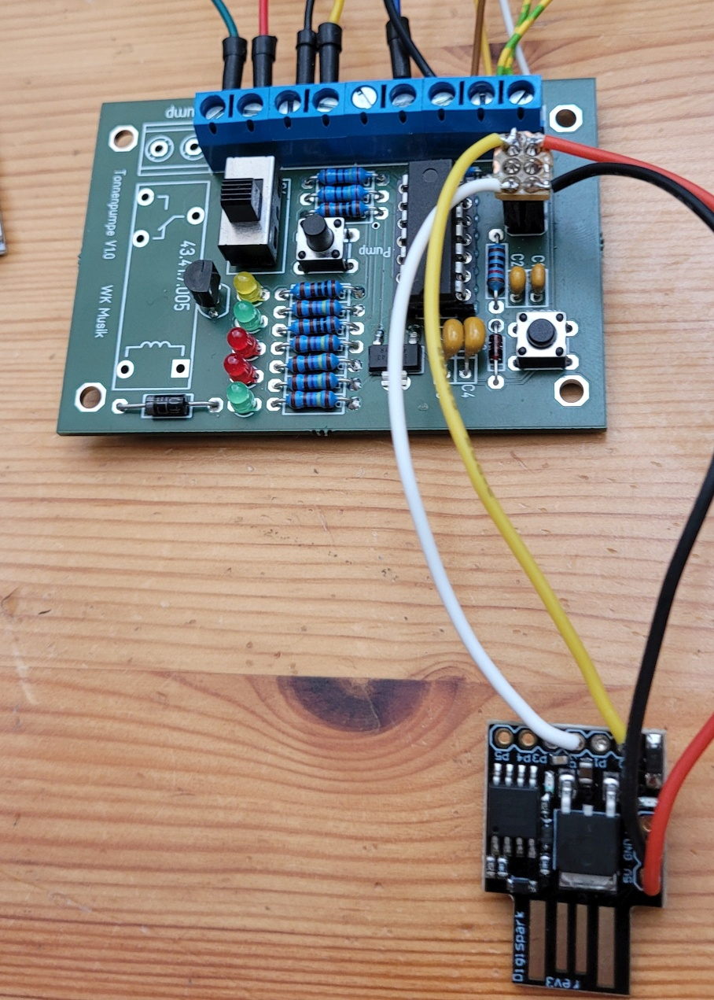
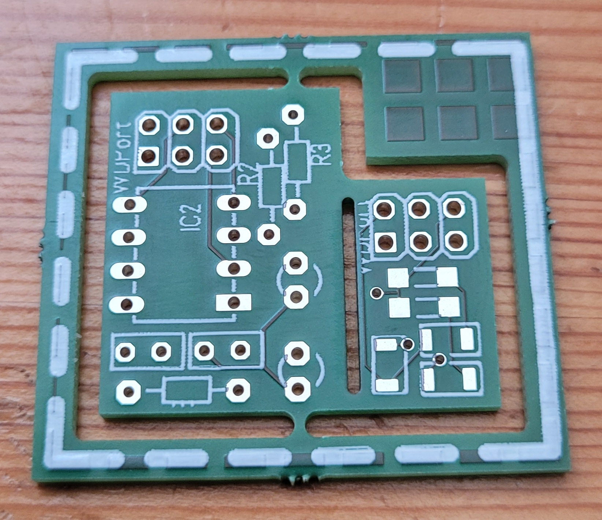
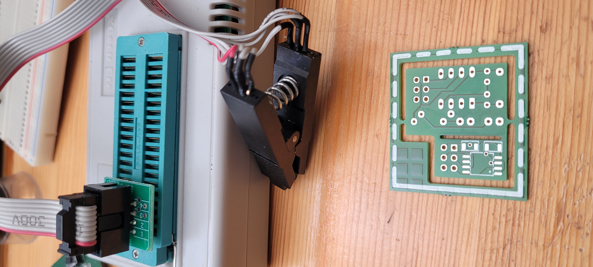
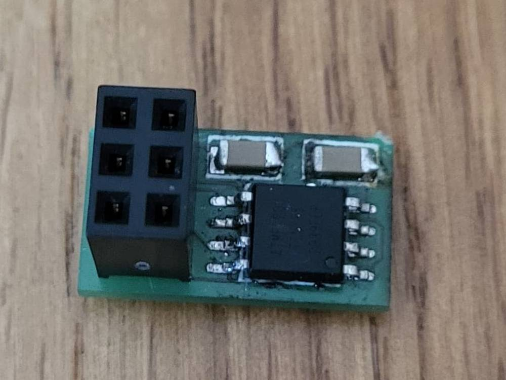
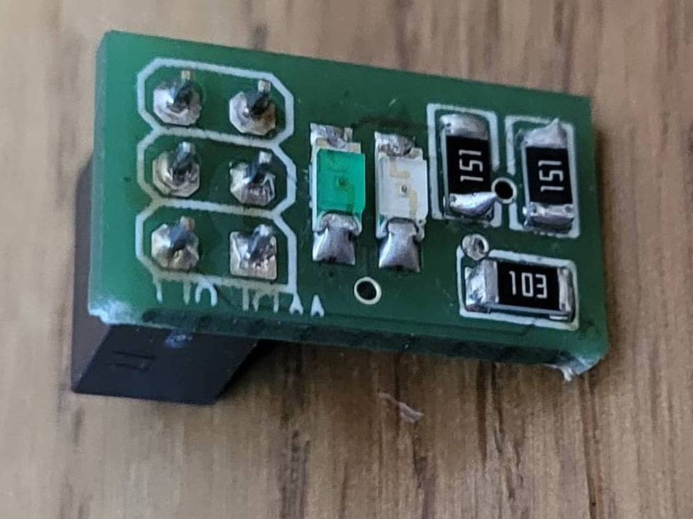
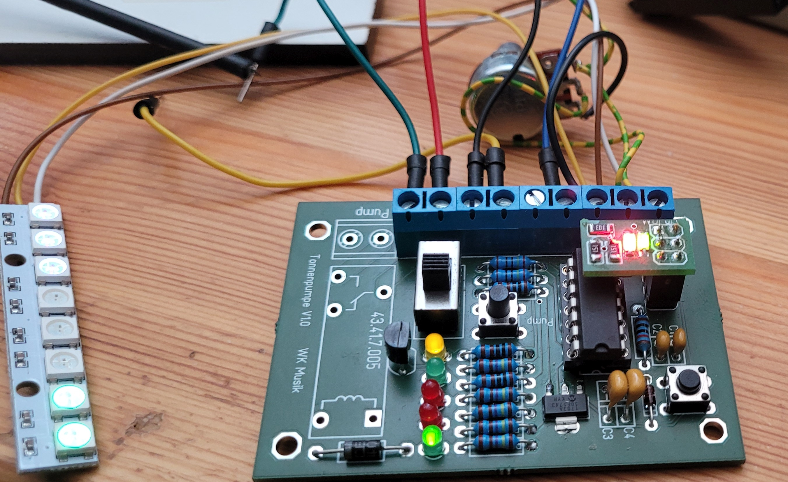
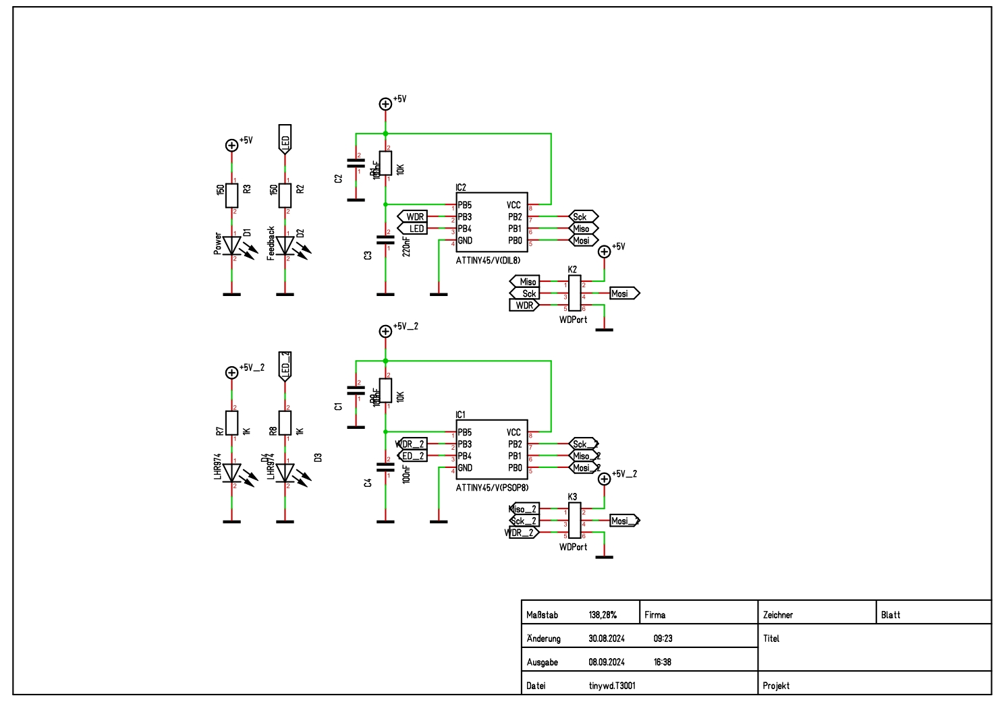

# TinyWD

This is a hardware watchdog, build for Arduino and other MCU directly pluggable to the ISP connector.

It's build from an Attiny 45/85. 

from here I describe the structure in German

Dies ist ein Hardware Watchdog, aufgebaut mit einem ATTIny84. Ziel ist es, eine vorhanden Controllerplatine nachträglich mit einem Watchdog auszustatten. Denn manchmal reicht der in den Chips eingebaute Watchdog nicht aus, bzw. ist nicht zuverlässig genug. So ist es mir bei meinem Tonnenpumpen Projekt ergangen. Der im ATTiny84 eingebaute Watchdog konnte den Controller nicht zuverlässig vor einem Einfrieren schützen. Immer wieder musste ich den Controller per Hand Resetten. Natürlich gibt es auch fertige Watchdogs, meist in Transistor oder DIP-8 Form. Doch die Beschaffung war schwierig und außerdem macht es doch Spass, sowas selber zu designen. Deswegen habe ich auf Basis des ATTiny85 diesen Hardware Watchdog gebaut, der auf einen normalen 6-Pol Programmierstecker aufgesteckt werden kann.  Zunächst aber habe ich eine VAriante für den Digispark entworfen, um die prinzipielle Funktionsweise zu testen. 																																											

## Digispark Version

Die ersten Tests hab ich mit einem Digispark gemacht. Leider ergibt sich durch den USB Bootloader, dass man beim Digispark nicht alle Pins für den Watchdog verwenden kann. Bei den Pins für den USB kommt es dazu, dass der Digispark einfach nicht starten möchte. Ursache ist der Nukleus Bootloader.

## PCB Variante

Der Digispark ist zwar nett, aber eine eigenes PCB könnte man deutlich kleiner machen. Sowohl mit als auch ohne SMD Bausteine. Hier mal die fertige Platine:

Links ist die klassische Variante mit normalen Bauteilen, rechts die deutlich kleinere SMD Variante. (Der Chip wird auf der Unterseite montiert.)

Hier die Rückseite. Oben im Bild sieht man auch den Programmieradapter und mein Programmiergerät. 

Bestückt sieht das ganze so aus:

Und auf die Tonnenpumpeplatine aufgesteckt:

Hier der Schaltplan: Oben die normale Variante, unten die SMD. 
