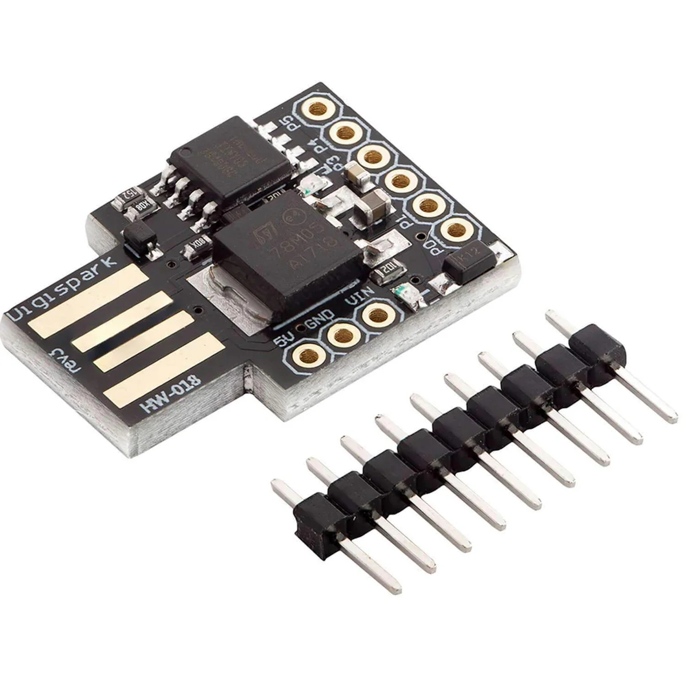
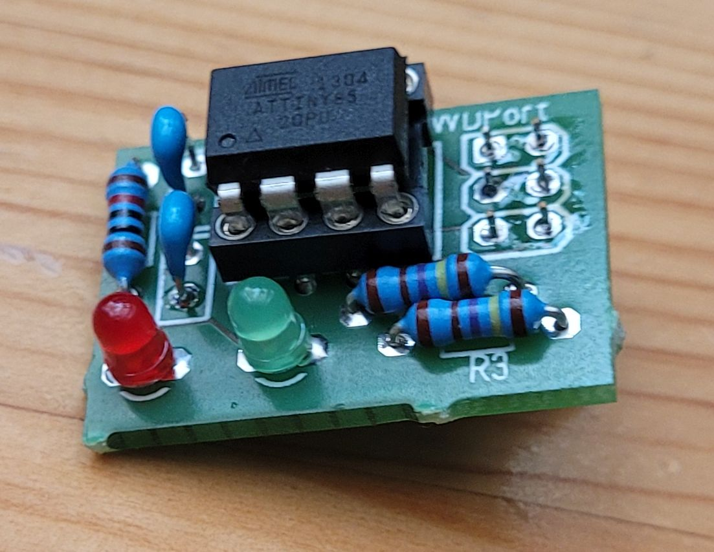
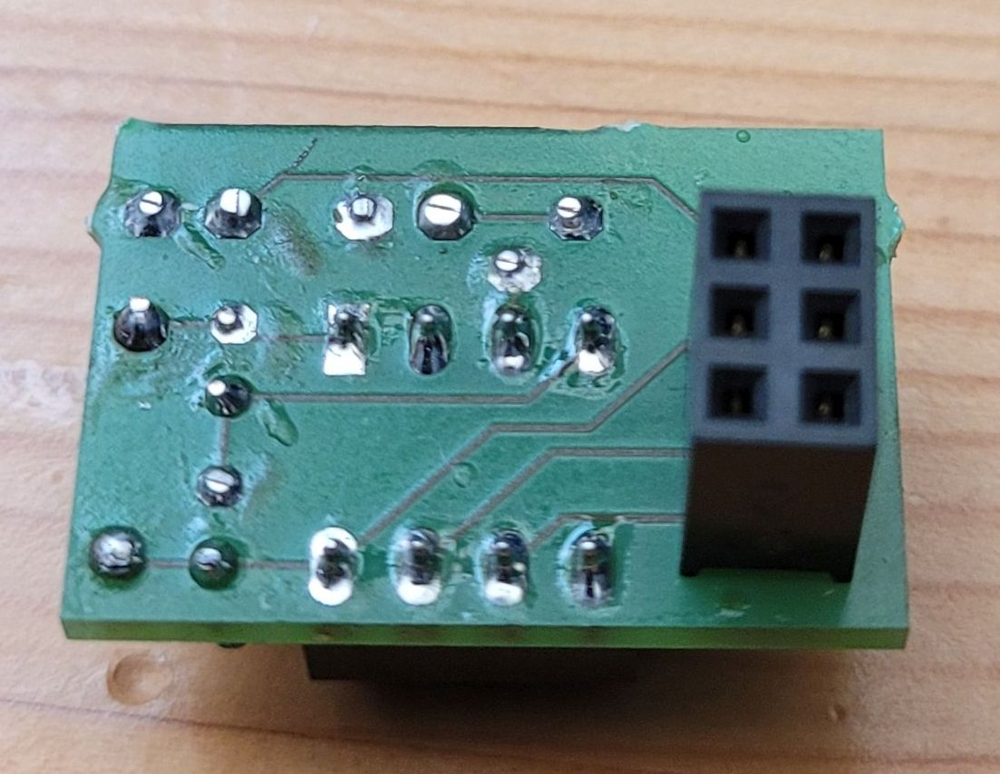
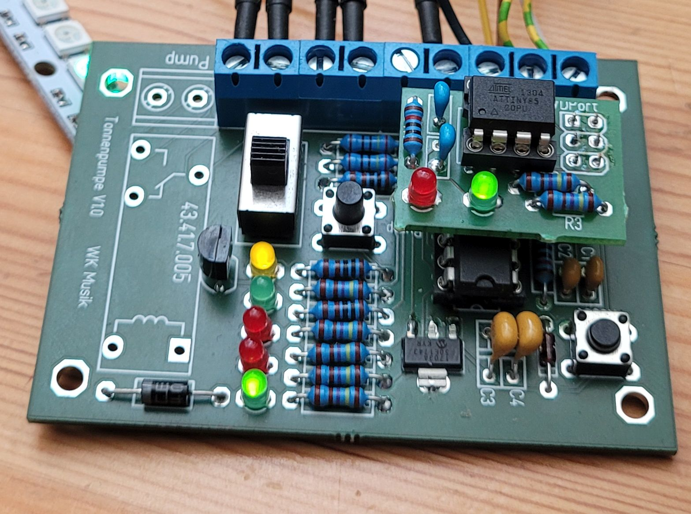
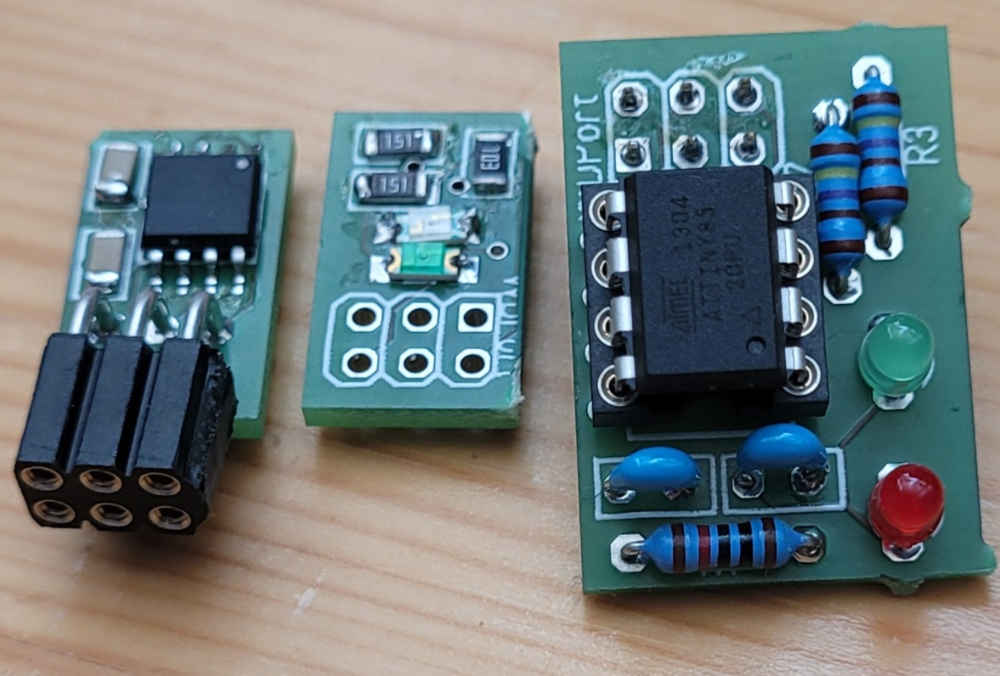

# TinyWD

This is a hardware watchdog, build for Arduino and other MCU directly pluggable to the ISP connector.

It's build from an Attiny 45/85. 

from here I describe the structure in German

Dies ist ein Hardware Watchdog, aufgebaut mit einem ATTiny84. Ziel ist es, eine vorhanden Controllerplatine nachträglich mit einem Watchdog auszustatten. Denn manchmal reicht der in den Chips eingebaute Watchdog nicht aus, bzw. ist nicht zuverlässig genug. So ist es mir bei meinem Tonnenpumpen Projekt ergangen. Der im ATTiny84 eingebaute Watchdog konnte den Controller nicht zuverlässig vor einem Einfrieren schützen. Immer wieder musste ich den Controller per Hand Resetten. Natürlich gibt es auch fertige Watchdogs, meist in Transistor oder DIP-8 Form. Doch die Beschaffung war schwierig und außerdem macht es doch Spaß, sowas selber zu designen. Deswegen habe ich auf Basis des ATTiny85 diesen Hardware Watchdog gebaut, der auf einen normalen 6-Pol ISP Programmierstecker aufgesteckt werden kann.  Zunächst aber habe ich eine Variante für den Digispark entworfen, um die prinzipielle Funktionsweise zu testen. Der Vorteil der ISP Aufsteckvariante ist der, das man ja üblicherweise die Pins des ISP selten für seine eigene Schaltung verwendet. Und wenn, dann doch als SPI (was direkt den WD triggern könnte) um nicht durch die eigene Schaltung das ISP zu verwirren.  																																											

# Digispark Version

Als erste Variante hab ich den Digispark ale Entwicklungsplatform benutzt. 



Die ersten Tests hab ich mit einem Digispark gemacht. Leider ergibt sich durch den USB Bootloader, dass man beim Digispark nicht alle Pins für den Watchdog verwenden kann. Bei den Pins für den USB kommt es dazu, dass der Digispark einfach nicht starten möchte. Ursache ist der [Micronucleus](https://github.com/micronucleus/micronucleus) Bootloader.

Genauer: Der ATTiny85 arbeitet mit einem Micronucleus Bootlaoder. Dieser simuliert über 2 Pins (3,4) ein USB Schnittstelle. Diese wird dann vom Host (PC) erkannt und man kann dann das Programm in den ATTiny hochladen. 

Der Bootloader hat ich 2048 Bytes vom Flash reserviert. D.h. die Anwenderprogramm dürfen nicht mahr als 6KB haben. 

Daneben gibt es noch weitere Einschränkungen. 
Für den Watchdog fand ich folgende Pin Zuordnung eigentlich optimal, da sie mit dem ISP korrosdondiert. 
Einzig der Reset Pin musste so auf einen anderen Pin gelegt werden.
So ist auch die eigene Hardware gebaut. PB4 ist dabei für die visuelle Rückmeldung (LED) zuständig. 
Beim Digispark sind aber leider verschiedene Änderungen nötig.
PB1 ist für die Onboard LED da.
PB3 ist ein USB Data Pin und kann leider somit nicht als Reset Output funktionieren. Das Problem ist, bei einem Neustart setzt der Micronucleus Bootloader diesen Pin auf 0. Somit wird dann gesteuerte Controller ion den Resetmodus versetzt. Auch Pin 4 wird Ausgang benutzt. Bei der o.g. Beschaltung hängt sich dann aber der Bootlaoder auf, normalerweise startet der Bootloader nach 6 Sekunden das Anwenderprogramm (in unserem Fall den Watchdog) mit der äußeren Beschaltung tat er das aber nicht. Somit waren sowohl der Digispark wie auch der angeschlossene Controller geblockt. 
Deswegen gilt für den Digispark eine andere Pinbelegung.

PB0 ist ein WD Pin
PB1 ist die LED
PB2 ist der WDReset Pin
PB3, PB4, PB5 werden nicht verwendet.


# PCB Varianten

Der Digispark ist zwar nett, aber ein eigenes PCB kann man deutlich kleiner machen. Sowohl mit als auch ohne SMD Bausteine. 

Hier der Schaltplan: Oben die normale Variante, unten die SMD. 

Steckerbelegung ISP:

| ISP  | Name  | ATTiny pin |
| ---- | ----- | ---------- |
| 1    | MISO  | PB1        |
| 2    | Vcc   | +5V        |
| 3    | SCK   | PB2        |
| 4    | MOSI  | PB0        |
| 5    | Reset | PB3        |
| 6    | GND   | GND        |

Hier mal die fertige Platine:


Links ist die klassische Variante mit normalen Bauteilen, rechts die deutlich kleinere SMD Variante. (Der Chip wird auf der Unterseite montiert.)


Hier die Rückseite. Oben im Bild sieht man auch den SOIC-8 Programmieradapter und mein Programmiergerät. 

Wichtig ist, das man vorher weiß, wo der WD eingesetzt werden soll. Will man den WD, so wie ich, direkt auf den ISP aufsetzen, ist es wichtig, die Buchse (2x3) auf der Platinen Unterseite zu platzieren. (Siehe Fotos)

Will man den WD per 6-pol Kabel mit dem ISP verbinden, braucht man eine 2x3 Stiftleiste, die auf die Vorderseite (wie aufgedruckt) gelötet wird.

Will man gar keinen ISP zur Kopplung verwenden, kann man einfach die 3 rechten Lötpunkte, plus dem WD Reset von dem ISP verwenden. Dabei gilt 

| Pin   | Bedeutung |
| ----- | --------- |
| Pin 2 | +5V       |
| Pin 4 | Hearbeat  |
| Pin 5 | WD_Reset  |
| Pin 6 | GND       |


## NoSMD Variante

Hier mal die normale Variante:

 

Aufgesetzt auf meine Tonnenpumpe sieht dass so aus:



Verwendet werden hier 2 Low-Current 3mm LEDs.

BOM:

| Anzahl | Bauteil                 | Gehäuse |
| ------ | ----------------------- | ------- |
| 1      | ATTiny85                | DIP8    |
| 1      | IC Sockel               | DIP8    |
| 2      | 1k5 Metallschicht       |         |
| 1      | 10k Metallschicht       |         |
| 2      | 100nF                   | RM2.54  |
| 1      | 3mm LED LowCurrent grün |         |
| 1      | 3mm LED LowCurrent rot  |         |

## SMD Variante

Bestückt sieht die SMD Version so aus:


Und auf die Tonnenpumpeplatine aufgesteckt:


| Anzahl | Bauteil               | Gehäuse |
| ------ | --------------------- | ------- |
| 1      | SMD ATTiny85          | SOIC-8  |
| 2      | SMD 1k5               | 1206    |
| 1      | SMD 10k Metallschicht | 1206    |
| 2      | SMD 100nF             | 1206    |
| 1      | SMD LED grün          | 1206    |
| 1      | SMD LED rot           | 1206    |

## Andere mögliche Varianten



# Software

Die Software für den WD findet ihr hier in dem Github Repo: https://github.com/willie68/TinyWD

## Projekt

Die Software auf der Gegenseiten ist recht einfach. Man mus nur immer einen der ISP Pins als Ausgang definieren und in regelmäßigen Abständen diesen Pin toggeln.

das geht recht einfach mit `digitalWrite(pin, !digitalRead(pin))` 

Bei meiner Tonnenpumpe musste ich allerdings etwas anders vorgehen, da der Pin für den Heartbeat bereits anderweitig (LED Pumpe) vergeben war. Also gebe ich hier ca. jede Sekunde einen kurzen Implus (ca 10ms) auf den Pin. Um den Pin Status nicht zu verlieren, speichere ich mir diesen einmal vorher ab.

Wenn man den TinyWD aber von vornherein berücksichtigt, erspart man sich diesen zusätzlichen Aufwand.    

```c++
unsigned long saved = 0; 
void heartbeat() { 
  if (millis() > saved) { 
    saved = millis() + 1000; 
    bool tmp = digitalRead(LED_PUMP); 
    digitalWrite(LED_PUMP, !tmp); 
    delay(10); 
    digitalWrite(LED_PUMP, tmp); 
  } 
} 
```

## Firmware

Die Software ist sehr einfach.

In ''void setup()'' setzte ich die Ein/Ausgänge entsprechend. Eingänge jeweils mit Pullup Widerstand.
Zur Startsignalisierung blinkt einmal kurz die LED.
Im nächsten Schritt werden für die Eingänge sog. PinChange Interrupts konfiguriert. D.h. ändert einer der Eingänge seinen Status, wird automatisch ein Interrupt ausgeführt.
Dieseer steht in der Methode ISR (PCINT0_vect).

Als letztes erzeuge ich mir einen Timer, der automatisch alle 10 Sekunden feuert. Diese Routine setzt dann ein Flag, welcher in der ''void main()'' dann getestet wird. In der main wird auch ein Heartbeat Signal an die LED gesendet.

### Funktionsweise

In der ISR wird einfach ein Variable namens changed auf true gesetzt. In der Hauptloop wird genau auf changed == true geprüft und dann der TImer resettet. Changed wird dann wieder auf false gesetzt und eine visuelle Rückmeldung gegeben.
Fehlt länger als 10 Sekunden der Interrupt, weil sich kein Pin geändert hat, löst der Timer die Reset Methode aus. Diese legt den Resetpin für 1 Sekunde auf GND. Danach hat der angeschlossene Controller wieder 10 Sekunden Zeit, einen der Eingänge zu toggeln.
